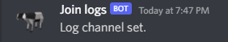

# 📝 Logging

Logging is an advanced feature that scans for changes to the server and everything within, classified as "events". Events are categorized into 4 groups:

* Moderation
* Server
* Joins
* General

### Here are the steps to enable logging in your server.

#### Step 1: Create webhooks

In the channels you want logs sent to, open settings.

.png>)

Next, go into integrations and make a webhook in every channel you want log in.

&#x20;.png>)

#### Step 2: Set logs

In your webhook settings, copy the urls one at a time. **Do not share this url with anyone.**

****.png>)****

Then, go back to your channel and use /owner setlogs. Paste all the fields as the different webhook urls. You may leave some blank if you wish not to log those events.

.png>)

You should see a message in every channel you set. If you can't get it, refer to [.](./ "mention").

